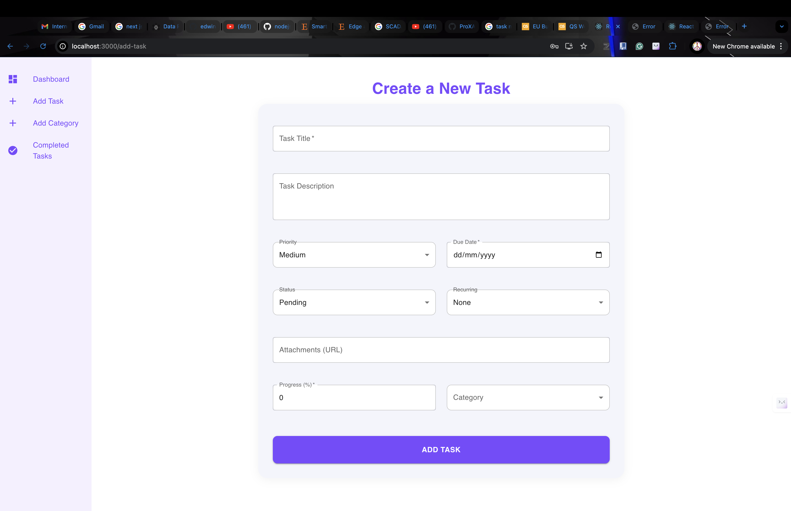

# PeakTask1

**PeakTask1** is a task management application that allows users to manage tasks with features like creating, updating, completing tasks, and categorizing them. The app has a user-friendly frontend built with React and a backend API built using Node.js and Express. The application can also be deployed using Docker or directly on cloud services like Netlify or Heroku.

## Features
- **Task Management:** Add, edit, delete, and categorize tasks.
- **Progress Tracking:** Track task progress with visual indicators.
- **Category Management:** Organize tasks into categories.
- **User Authentication:** Secure login and registration for user accounts.
- **Responsive Design:** A mobile-friendly UI for task management on the go.

---

## Table of Contents
- [Installation](#installation)
- [Running the Application](#running-the-application)
- [Screenshots](#screenshots)
- [Technologies](#technologies)
- [Environment Variables](#environment-variables)
- [Docker Setup](#docker-setup)
- [Contributing](#contributing)
- [License](#license)

---

## Installation

To run this project locally, follow these steps:

### Prerequisites
Make sure you have the following installed:
- Node.js (v16 or higher)
- MySQL (for the database)
- Docker (optional, for containerization)

### Clone the repository:
```bash
git clone https://github.com/your-username/peaktask1.git
cd peaktask1
```

### Install Backend Dependencies:
Navigate to the root directory and install backend dependencies:
```bash
cd server
npm install
```

### Install Frontend Dependencies:
Navigate to the `frontend` directory and install frontend dependencies:
```bash
cd frontend
npm install
```

---

## Running the Application

### 1. Configure Environment Variables:
Create a `.env` file in the root directory with the following contents:

```env
PORT=5003
JWT_SECRET=your_jwt_secret_here

# MySQL Database Configuration
DB_HOST=localhost
DB_USER=root
DB_PASSWORD=your_password
DB_NAME=peaktask
DB_PORT=3306
```

### 2. Setup MySQL Database:
Run the following SQL commands to create the database:
```sql
CREATE DATABASE peaktask;
```
You can also use your preferred GUI tool like phpMyAdmin or MySQL Workbench to create the database.

### 3. Run the Backend Server:
Navigate to the root directory and run the backend server:
```bash
cd server
npm start
```

### 4. Run the Frontend:
Navigate to the `frontend` folder and start the React app:
```bash
cd frontend
npm start
```

The application will now be accessible at `http://localhost:3000`.

---

## Docker Setup

To run the application using Docker, ensure Docker is installed and running, then follow these steps:

### 1. Build and Run Docker Containers:
```bash
docker-compose up --build
```

### 2. Access the Application:
Once Docker has finished setting up, open your browser and visit:
```
http://localhost:5003
```

This will run both the backend and frontend using Docker containers.

---

## Screenshots


| **Login Page** | **Dashboard** |
| -------------- | ------------- |
|  |  |

| **Empty Dashboard** | **Dashboard with tasks** |
| -------------- | ------------- |
|  |  |

 **Create a Task Page**

 

 **Create categories Page**

 

 **Completed Tasks Page**

 

 **Task Details Page**

 


---

## Technologies

- **Frontend:** React, Material-UI
- **Backend:** Node.js, Express.js
- **Database:** MySQL
- **Authentication:** JWT (JSON Web Tokens)
- **Containerization:** Docker
- **Deployment:** Netlify, Heroku (optional)

---

## Environment Variables

The application uses the following environment variables, which must be added to a `.env` file:

```env
PORT=5003
JWT_SECRET=your_jwt_secret_here

# MySQL Database Configuration
DB_HOST=localhost
DB_USER=root
DB_PASSWORD=your_password
DB_NAME=peaktask
DB_PORT=3306
```

---

## Contributing

Contributions are welcome! If you'd like to contribute, please follow these steps:

1. Fork the repository.
2. Create a new branch (`git checkout -b feature-branch`).
3. Make your changes and commit (`git commit -m 'Add some feature'`).
4. Push to the branch (`git push origin feature-branch`).
5. Open a pull request.

---

## License

This project is licensed under the MIT License. See the [LICENSE](./LICENSE) file for details.

---

## Contact

For any inquiries, you can contact me at:

- **Name:** Ted Aringo
- **Email:** tedaringo628@gmail.com
- **GitHub:** (https://github.com/edwinaringo)

---
